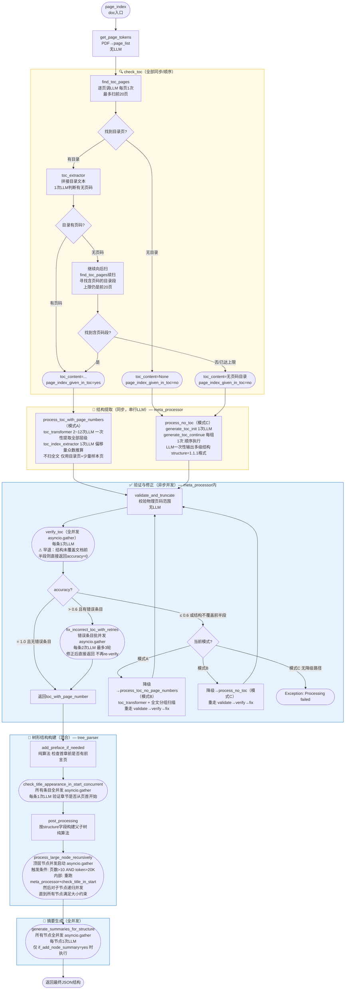

# PageIndex 完整代码逻辑逐行解析

> 覆盖文件：`pageindex/page_index.py`、`pageindex/utils.py`、`pageindex/config.yaml`
> 默认配置：`toc_check_page_num=20`、`max_page_num_each_node=10`、`max_token_num_each_node=20000`、`if_add_node_summary=yes`

---

## 一、整体处理流程图

> 图例：**黄色/方框** = 顺序执行（串行LLM）；**蓝色/圆角** = 并发执行（asyncio.gather）；**菱形** = 判断分支



### 耗时分析：每一步的并发性与等待时间

> 假设：单次 LLM 调用耗时 **T 秒**（约 3~6 秒），文档 100 页，约 70000 token，目录有 20 条一级章节，每组约 20 页。

---

**阶段一：目录检测（顺序，累加耗时）**

- `find_toc_pages`：逐页调用 LLM 判断是否是目录页
  - **顺序执行**，每页一次
  - 实际调用次数：找到目录页后停止，通常 2~5 次
  - 最多扫前 20 页 = 最多 20 次
  - **等待时间 = 调用次数 × T**

- `toc_extractor`（判断有无页码）：**1 次 LLM，+T**

---

**阶段二：结构提取（顺序，累加耗时）**

_Mode A（有页码目录）：_

- `toc_transformer`（目录文本 → JSON）
  - **顺序执行**，目录短时 1~2 次，目录长时续写最多 12 次
  - **等待时间 = 调用次数 × T**（通常 1~2T）

- `toc_index_extractor`（偏移量推算）
  - **1 次 LLM，+T**

_Mode C（无目录）：_

- `generate_toc_init` + `generate_toc_continue` × N 组
  - **顺序执行**，每组依赖上一组的输出（续写），不能并发
  - 100 页 / 20 页每组 = 5 组 → **5 次 LLM，等待时间 = 5T**

---

**阶段三：验证与修正（并发，接近常数耗时）**

- `validate_and_truncate`：纯算法，**无 LLM，不计入**

- `verify_toc`（验证所有条目物理页码是否正确）
  - **全并发**（asyncio.gather），20 条同时发出请求
  - **等待时间 ≈ T**（取最慢的一次，无论多少条）

- `fix_incorrect_toc_with_retries`（修正错误条目，最多 3 轮）
  - 每条错误：2 次 LLM（1 次定位 + 1 次验证），条目间**并发**
  - 轮次间**顺序**（等上一轮全部完成才开始下一轮）
  - **等待时间 = 轮数 × （2T）** 最坏 3 轮 = 6T，通常 1 轮 = 2T

---

**阶段四：树形结构构建（混合）**

- `add_preface_if_needed`：纯算法，**无 LLM，不计入**

- `check_title_appearance_in_start_concurrent`（所有条目验证起始位置）
  - **全并发**（asyncio.gather）
  - **等待时间 ≈ T**

- `post_processing`（构建父子树）：纯算法，**无 LLM，不计入**

- `process_large_node_recursively`（对超大节点提取子章节）
  - 顶层章节间：**并发**（asyncio.gather）
  - 每个章节内部（`process_no_toc`，分组续写）：**顺序**
  - **等待时间 = 最慢章节的分组数 × T**
  - _Mode A 典型场景：3 个大章节并发，各章节内部 3~5 组_
  - _→ 等待时间 = 最慢章节的组数 × T = 约 5T_

---

**阶段五：摘要生成（全并发）**

- `generate_summaries_for_structure`（所有节点生成摘要）
  - **全并发**（asyncio.gather），仅在 `if_add_node_summary=yes` 时执行
  - **等待时间 ≈ T**（无论多少个节点）

---

**典型总耗时（Mode A，100 页，T = 4 秒）**

1. 目录检测：3 次 × T = **12 秒**（顺序）
2. toc_extractor：1 次 × T = **4 秒**（顺序）
3. toc_transformer：2 次 × T = **8 秒**（顺序）
4. toc_index_extractor：1 次 × T = **4 秒**（顺序）
5. verify_toc：并发 → **≈ 4 秒**
6. fix_incorrect_toc（1 轮）：并发 → **≈ 8 秒**
7. check_title_in_start：并发 → **≈ 4 秒**
8. process_large_node（最慢章节 4 组，顺序）：4 × T = **16 秒**
9. 大节点内 verify + check_title：并发 → **≈ 8 秒**
10. generate_summaries：并发 → **≈ 4 秒**

**合计 ≈ 72 秒 ≈ 1.2 分钟**

> 瓶颈在**顺序阶段**（步骤 1~4 和步骤 8）：共约 44 秒。
> 并发阶段（步骤 5~7, 9~10）：共约 28 秒，但随条目数量增加几乎不变。

---

## 整体调用链（文本版）

```
page_index(doc)               用户入口
  └─ page_index_main(doc, opt)
       └─ asyncio.run(page_index_builder())
            └─ tree_parser(page_list, opt)
                 ├─ check_toc(page_list, opt)         [同步] 目录检测
                 ├─ meta_processor(...)                [异步] 结构提取+验证
                 ├─ check_title_appearance_in_start_concurrent()  [异步并发]
                 ├─ post_processing()                  [同步] 构建树形结构
                 └─ process_large_node_recursively()   [异步并发] 大节点递归
            └─ generate_summaries_for_structure()      [异步并发] 摘要生成
```

---

## 二、完整处理示例（大章节文档）

以下通过一个具体案例，展示从 PDF 输入到最终 JSON 结构的每一步中间结果。

**文档设定**：200页技术报告，目录页只有一级章节，多个章节跨度很大。

### 初始目录页内容

```
第一章 绪论              1
第二章 系统架构设计       16
第三章 核心功能实现       81
第四章 测试与验证        161
第五章 结语             191
```

---

### Step 1：目录检测（check_toc）

```
find_toc_pages 扫前20页，第2~3页被识别为目录页
toc_extractor 拼合目录文本，1次LLM → has_toc=true, has_page_numbers=true
```

**中间结果**：确认有目录，有页码。

---

### Step 2：目录转 JSON（toc_transformer，2次LLM）

```json
[
  {"title": "第一章 绪论",        "page": 1,   "level": 1},
  {"title": "第二章 系统架构设计", "page": 16,  "level": 1},
  {"title": "第三章 核心功能实现", "page": 81,  "level": 1},
  {"title": "第四章 测试与验证",   "page": 161, "level": 1},
  {"title": "第五章 结语",        "page": 191, "level": 1}
]
```

> `page` 是目录页写的页码，不是物理页码。第2次LLM验证完整性，确认不需要续写。

---

### Step 3：物理页码推算（toc_index_extractor，偏移量众数投票）

```
采样前3条，在物理页中搜索标题：
  "第一章 绪论"    目录写 page=1，物理搜到第3页 → offset = +2
  "第二章 架构"    目录写 page=16，物理搜到第18页 → offset = +2
  "第三章 实现"    目录写 page=81，物理搜到第83页 → offset = +2
  众数 offset = 2
```

**中间结果（所有条目批量映射）**：

```json
[
  {"title": "第一章 绪论",        "page": 1,   "physical_index": 3  },
  {"title": "第二章 系统架构设计", "page": 16,  "physical_index": 18 },
  {"title": "第三章 核心功能实现", "page": 81,  "physical_index": 83 },
  {"title": "第四章 测试与验证",   "page": 161, "physical_index": 163},
  {"title": "第五章 结语",        "page": 191, "physical_index": 193}
]
```

---

### Step 4：并发验证（verify_toc，5条全并发）

```
asyncio.gather 同时发出5个LLM请求：
  第一章 绪论      → is_correct: true
  第二章 系统架构  → is_correct: true
  第三章 核心实现  → is_correct: false  （第83页是上章结尾，标题在第84页）
  第四章 测试验证  → is_correct: true
  第五章 结语      → is_correct: true

accuracy = 4/5 = 0.8 > 0.6 → 进入修正
```

---

### Step 5：修正第三章（fix_incorrect_toc，单条2次LLM）

```
第一次LLM：在物理第78~88页（±5页范围）内搜索标题
→ corrected_index = 84

第二次LLM：验证第84页是否为章节起始页（标题在页面顶部）
→ is_start: true

更新 physical_index = 84
```

**第二轮 verify_toc**（全并发）：`accuracy = 5/5 = 1.0`，退出修正循环。

---

### Step 6：构建树并计算节点大小（post_processing）

```
根据相邻条目 physical_index 推算每章页数（token≈700/页）：
  第一章 绪论：   第3~17页   = 15页 × 700 = 10500 token  → 不触发递归
  第二章 架构设计：第18~83页  = 66页 × 700 = 46200 token  → ✓ 触发递归
  第三章 核心实现：第84~162页 = 79页 × 700 = 55300 token  → ✓ 触发递归
  第四章 测试验证：第163~192页 = 30页 × 700 = 21000 token → ✓ 触发递归
  第五章 结语：   第193~202页 = 10页 × 700 = 7000 token   → 不触发
```

**触发条件**：页数 > 10 **且** token > 20000

---

### Step 7：三章并发递归（process_large_node_recursively）

三章 **同时** 启动（asyncio.gather），每章内部**顺序**执行 `process_no_toc`：

**第二章（66页，7组）内部顺序LLM**：

```
group_1（第18~27页）: generate_toc_init   → 生成初始子章节
group_2（第28~37页）: generate_toc_continue → 续写
group_3（第38~47页）: generate_toc_continue → 续写
...
group_7（第78~83页）: generate_toc_continue → 续写
合并7组结果 → 第二章子目录
```

**第二章子目录中间结果**：

```json
[
  {"title": "2.1 总体架构概述",  "physical_index": 18},
  {"title": "2.2 前端模块设计",  "physical_index": 24},
  {"title": "2.3 后端模块设计",  "physical_index": 38},
  {"title": "2.4 数据层设计",    "physical_index": 56},
  {"title": "2.5 接口规范与协议", "physical_index": 72}
]
```

第三章、第四章同时以相同方式处理（各自内部顺序，三章之间并发）。

---

### 最终 JSON 结构

```json
{
  "structure": [
    {
      "title": "第一章 绪论",
      "physical_index": 3, "end_index": 17,
      "children": []
    },
    {
      "title": "第二章 系统架构设计",
      "physical_index": 18, "end_index": 83,
      "children": [
        {"title": "2.1 总体架构概述",   "physical_index": 18, "end_index": 23},
        {"title": "2.2 前端模块设计",   "physical_index": 24, "end_index": 37},
        {"title": "2.3 后端模块设计",   "physical_index": 38, "end_index": 55},
        {"title": "2.4 数据层设计",     "physical_index": 56, "end_index": 71},
        {"title": "2.5 接口规范与协议", "physical_index": 72, "end_index": 83}
      ]
    },
    {
      "title": "第三章 核心功能实现",
      "physical_index": 84, "end_index": 162,
      "children": [ ... ]
    },
    {
      "title": "第四章 测试与验证",
      "physical_index": 163, "end_index": 192,
      "children": [ ... ]
    },
    {
      "title": "第五章 结语",
      "physical_index": 193, "end_index": 202,
      "children": []
    }
  ]
}
```

**原来5个顶层节点 → 最终约20~30个带完整层级的节点。**

### 本例 LLM 调用统计

| 阶段 | 调用次数 | 是否并发 |
|------|---------|---------|
| find_toc_pages（目录检测） | 3次 | 否，顺序 |
| toc_extractor + transformer + index_extractor | 4次 | 否，顺序 |
| verify_toc 第一轮 | 5次 | **是，全并发** |
| fix_incorrect_toc（1条 × 2次）| 2次 | — |
| verify_toc 第二轮 | 5次 | **是，全并发** |
| process_large_node（3章 × 7组）| 21次 | **顶层并发，内部顺序** |
| check_title_in_start | 20次 | **是，全并发** |
| generate_summaries | 25次 | **是，全并发** |
| **合计** | **~85次** | — |

---

## 三、入口函数

### `page_index()` — 公开 API 入口

```python
def page_index(doc, model=None, toc_check_page_num=None, ...):
    # 收集用户传入的非None参数，覆盖默认配置
    user_opt = {arg: value for arg, value in locals().items() if arg != "doc" and value is not None}
    opt = ConfigLoader().load(user_opt)
    return page_index_main(doc, opt)
```

### `page_index_main()` — 主流程

```python
def page_index_main(doc, opt=None):
    logger = JsonLogger(doc)   # 初始化JSON日志记录器

    # 验证输入：只接受 .pdf 文件路径 或 BytesIO 对象
    is_valid_pdf = (isinstance(doc, str) and doc.lower().endswith(".pdf")) or isinstance(doc, BytesIO)
    if not is_valid_pdf:
        raise ValueError(...)

    # 用 PyMuPDF 提取全文，返回 [(page_text, token_count), ...] 列表
    # page_list[i][0] = 第i页文本
    # page_list[i][1] = 第i页token数
    page_list = get_page_tokens(doc, model=opt.model)  # 无LLM，纯文本提取

    async def page_index_builder():
        structure = await tree_parser(page_list, opt, doc=doc, logger=logger)

        if opt.if_add_node_id == 'yes':
            write_node_id(structure)       # 为每个节点生成UUID，无LLM

        if opt.if_add_node_summary == 'yes':
            add_node_text(structure, page_list)          # 为节点附加原文，无LLM
            await generate_summaries_for_structure(structure, model=opt.model)  # 并发生成摘要
            # 若不需要保留原文，删掉它（节省响应体积）
            if opt.if_add_node_text == 'no':
                remove_structure_text(structure)

            if opt.if_add_doc_description == 'yes':
                # 额外生成文档整体描述，1次同步LLM调用
                doc_description = generate_doc_description(clean_structure, model=opt.model)

        return {'doc_name': get_pdf_name(doc), 'structure': structure}

    return asyncio.run(page_index_builder())
```

---

## 三、目录检测阶段（同步）

### `check_toc()` — 总调度（同步）

```python
def check_toc(page_list, opt=None):
    # 第1轮扫描：从第0页开始找目录页
    toc_page_list = find_toc_pages(start_page_index=0, page_list=page_list, opt=opt)

    if len(toc_page_list) == 0:
        # 没有找到任何目录页 → 直接返回无目录
        return {'toc_content': None, 'toc_page_list': [], 'page_index_given_in_toc': 'no'}

    # 找到目录页，提取目录文本，判断是否含页码
    toc_json = toc_extractor(page_list, toc_page_list, opt.model)

    if toc_json['page_index_given_in_toc'] == 'yes':
        # 目录含页码 → 直接返回
        return {'toc_content': toc_json['toc_content'], ..., 'page_index_given_in_toc': 'yes'}

    else:
        # 目录不含页码 → 继续往后扫描，某些文档的目录分两段：
        # 前段是大标题（无页码），后段是小节标题（含页码）
        current_start_index = toc_page_list[-1] + 1   # 从已扫描的目录结束位置继续

        while (toc_json['page_index_given_in_toc'] == 'no'
               and current_start_index < len(page_list)
               and current_start_index < opt.toc_check_page_num):  # 不超过20页范围

            additional_toc_pages = find_toc_pages(
                start_page_index=current_start_index, ...)  # 继续向后找

            if len(additional_toc_pages) == 0:
                break  # 后面没有目录段了

            additional_toc_json = toc_extractor(page_list, additional_toc_pages, opt.model)
            if additional_toc_json['page_index_given_in_toc'] == 'yes':
                return {'toc_content': additional_toc_json['toc_content'], ..., 'page_index_given_in_toc': 'yes'}
            else:
                current_start_index = additional_toc_pages[-1] + 1  # 继续后移

        # 整个前20页都没找到含页码的目录段
        return {'toc_content': toc_json['toc_content'], ..., 'page_index_given_in_toc': 'no'}
```

**LLM调用**：每次 `find_toc_pages` 内部逐页调用，每次 `toc_extractor` 1次调用。

---

### `find_toc_pages()` — 逐页扫描（同步，每页1次LLM）

```python
def find_toc_pages(start_page_index, page_list, opt, logger=None):
    last_page_is_yes = False  # 记录"上一页是否是目录页"
    toc_page_list = []        # 收集目录页的0-based下标
    i = start_page_index

    while i < len(page_list):
        # 退出条件1：已扫够20页（toc_check_page_num=20）且还没找到目录
        # 说明这文档在前20页内没有目录
        if i >= opt.toc_check_page_num and not last_page_is_yes:
            break

        # 每页调1次LLM，让模型判断该页是否是目录页
        detected_result = toc_detector_single_page(page_list[i][0], model=opt.model)
        # 返回 'yes' 或 'no'

        if detected_result == 'yes':
            toc_page_list.append(i)
            last_page_is_yes = True      # 标记"目录区已开始"

        elif detected_result == 'no' and last_page_is_yes:
            # 退出条件2：当前页不是目录，但上一页是目录
            # → 目录区已结束，进入正文了，停止扫描
            break

        # 注意：若 'no' 且 last_page_is_yes=False，不会break
        # 代表目录还没开始，继续往后扫（目录可能在第3、5、8页等）
        i += 1

    return toc_page_list
```

**示例（目录在第3-5页，即下标2-4）**：
```
i=0: LLM→'no', last=False, 继续
i=1: LLM→'no', last=False, 继续
i=2: LLM→'yes', toc=[2], last=True
i=3: LLM→'yes', toc=[2,3], last=True
i=4: LLM→'yes', toc=[2,3,4], last=True
i=5: LLM→'no', last=True → break
共6次顺序LLM调用，返回 [2,3,4]
```

**示例（无目录，目录检测最坏情况）**：
```
i=0~18: LLM均返回'no', last始终False
i=19:   LLM→'no', last=False，触发退出条件1(19>=20? 不对，应该是i>=20时才退出)
i=20:   i>=toc_check_page_num(20) 且 last=False → break
共20次顺序LLM调用，返回 []
```

---

### `toc_detector_single_page()` — 单页目录检测（1次LLM）

```python
def toc_detector_single_page(content, model=None):
    # 构造prompt，让LLM判断这页文本是否是目录页
    # 特别说明：摘要、符号表、图表列表不算目录
    prompt = f"""检测给定文本中是否包含目录..."""
    response = llm_completion(model=model, prompt=prompt)  # 同步调用
    json_content = extract_json(response)
    return json_content['toc_detected']  # 返回 'yes' 或 'no'
```

---

### `toc_extractor()` — 提取目录内容（1次LLM，不逐页）

```python
def toc_extractor(page_list, toc_page_list, model):
    def transform_dots_to_colon(text):
        # 把 "第一章........ 1" 中的连续点号替换为 ": "
        # 避免点号干扰LLM解析结构
        text = re.sub(r'\.{5,}', ': ', text)
        text = re.sub(r'(?:\. ){5,}\.?', ': ', text)
        return text

    # 把所有目录页文本拼成一个字符串（无LLM，纯字符串拼接）
    toc_content = ""
    for page_index in toc_page_list:
        toc_content += page_list[page_index][0]  # [0]是文本，[1]是token数

    toc_content = transform_dots_to_colon(toc_content)

    # 调1次LLM：判断目录文本中是否包含页码数字
    has_page_index = detect_page_index(toc_content, model=model)

    return {
        "toc_content": toc_content,           # 处理过的目录文本（点号已转冒号）
        "page_index_given_in_toc": has_page_index  # 'yes' 或 'no'
    }
```

---

## 四、目录结构提取阶段（同步）

### `toc_transformer()` — 目录文本转JSON（带完整性重试，同步）

这个函数是**最复杂的同步函数**，含有完整性验证循环：

```python
def toc_transformer(toc_content, model=None):
    # 第1步：一次性把目录文本转成JSON结构
    init_prompt = """把目录转成JSON格式，含structure(层级索引如1.1.2)、title、page字段..."""
    prompt = init_prompt + '\n Given table of contents\n:' + toc_content

    last_complete, finish_reason = llm_completion(model, prompt, return_finish_reason=True)
    # finish_reason: 'finished'=正常结束, 'max_output_reached'=被token截断, 'error'=调用失败

    # 第2步：验证完整性（第2次LLM调用）
    if_complete = check_if_toc_transformation_is_complete(toc_content, last_complete, model)
    # LLM比较原始目录和转换结果，判断是否包含了所有章节

    if if_complete == "yes" and finish_reason == "finished":
        # 完整且未截断 → 直接解析JSON返回
        last_complete = extract_json(last_complete)
        return convert_page_to_int(last_complete['table_of_contents'])

    # 第3步：如果不完整或被截断，进入续写循环（最多5次）
    last_complete = get_json_content(last_complete)  # 提取已生成的JSON部分
    attempt = 0
    max_attempts = 5

    while not (if_complete == "yes" and finish_reason == "finished"):
        attempt += 1
        if attempt > max_attempts:
            raise Exception('Failed to complete toc transformation after maximum retries')

        # 截取到最后一个}，保证JSON格式不被截断中途
        position = last_complete.rfind('}')
        if position != -1:
            last_complete = last_complete[:position+2]

        # 续写prompt：把原始目录 + 已生成的不完整JSON都给LLM，让它继续生成后续部分
        prompt = f"""
        原始目录：{toc_content}
        已生成的不完整JSON：{last_complete}
        请继续生成剩余部分..."""

        new_complete, finish_reason = llm_completion(model, prompt, return_finish_reason=True)
        # new_complete 只包含续写的新增部分

        # 拼接到已有结果上
        if new_complete.startswith('```json'):
            new_complete = get_json_content(new_complete)
        last_complete = last_complete + new_complete

        # 再次验证完整性
        if_complete = check_if_toc_transformation_is_complete(toc_content, last_complete, model)
        # 每次循环：1次续写LLM + 1次验证LLM = 2次LLM调用

    last_complete = extract_json(last_complete)
    return convert_page_to_int(last_complete['table_of_contents'])
```

**LLM调用次数**：
- 最好情况：2次（1次生成 + 1次验证）
- 每次续写：2次（1次续写 + 1次验证）
- 最坏情况：2 + 5×2 = **12次**顺序调用

---

## 五、模式A详解：有目录 + 有页码

### `process_toc_with_page_numbers()` — 完整逐步解析（同步）

```python
def process_toc_with_page_numbers(toc_content, toc_page_list, page_list, toc_check_page_num, model):

    # 步骤1: 目录文本 → JSON（含page字段）
    # 输入："第一章 概述 ... 1\n第二章 安装 ... 8\n..."
    # 输出：[{"structure":"1","title":"概述","page":1}, {"structure":"2","title":"安装","page":8}]
    toc_with_page_number = toc_transformer(toc_content, model)  # 2~12次LLM（见上节）

    # 步骤2: 深拷贝后删除page字段，得到"只含title的目录"
    # 目的：下一步要让LLM从正文里找这些标题，不能泄露page答案
    toc_no_page_number = remove_page_number(copy.deepcopy(toc_with_page_number))
    # 输出：[{"structure":"1","title":"概述"}, {"structure":"2","title":"安装"}]

    # 步骤3: 确定"目录后的正文起始页"
    # toc_page_list[-1] = 最后一页目录的0-based下标
    # +1 就是正文第一页的0-based下标
    start_page_index = toc_page_list[-1] + 1

    # 步骤4: 取目录后紧接的N页正文，用<physical_index_X>标签包装
    # 这些标签是LLM识别物理页码的"锚点"
    main_content = ""
    for page_index in range(start_page_index,
                            min(start_page_index + toc_check_page_num, len(page_list))):
        # 注意：page_index是0-based下标，physical_index是1-based（用户视角的页码），所以+1
        main_content += f"<physical_index_{page_index+1}>\n{page_list[page_index][0]}\n<physical_index_{page_index+1}>\n\n"

    # 步骤5: 让LLM在带标签的正文里找每个章节标题的物理位置（1次LLM）
    # 输入：只含title的目录JSON + 带physical标签的若干页正文
    # 输出：[{"title":"概述","physical_index":"<physical_index_3>"}, ...]
    toc_with_physical_index = toc_index_extractor(toc_no_page_number, main_content, model)

    # 步骤6: 把"<physical_index_3>"字符串转成整数3（纯算法）
    toc_with_physical_index = convert_physical_index_to_int(toc_with_physical_index)

    # 步骤7: 配对"目录页码"和"物理页码"，计算偏移量（纯算法）
    # 示例：目录说第1章在page=1，LLM找到它在physical_index=3
    # → offset = 3 - 1 = 2（封面+目录页占了2页，导致物理页码比目录页码多2）
    matching_pairs = extract_matching_page_pairs(toc_with_page_number, toc_with_physical_index, start_page_index)
    offset = calculate_page_offset(matching_pairs)  # 取差值的众数，容错处理

    # 步骤8: 给所有目录条目批量赋值物理页码（纯算法）
    # physical_index = page + offset
    toc_with_page_number = add_page_offset_to_toc_json(toc_with_page_number, offset)

    # 步骤9: 处理page=None的条目（目录里没有页码的子条目）
    # 每个缺失条目：定位前后有页码的条目，取中间段，1次LLM找标题
    toc_with_page_number = process_none_page_numbers(toc_with_page_number, page_list, model=model)

    return toc_with_page_number
```

**核心优势**：步骤4只取约20页的正文做一次"样本映射"，用偏移量算法推算全部条目的物理页码，避免扫描全文。

---

## 六、模式B详解：有目录 + 无页码

### `process_toc_no_page_numbers()` — 完整逐步解析（同步）

```python
def process_toc_no_page_numbers(toc_content, toc_page_list, page_list, start_index=1, model):

    # 步骤1: 目录文本 → JSON（page字段均为None）
    # 输出：[{"structure":"1","title":"概述","page":None}, ...]
    toc_content = toc_transformer(toc_content, model)  # 2~12次LLM（顺序）

    # 步骤2: 对全文每页添加物理标签（纯算法，不调LLM）
    page_contents = []
    token_lengths = []
    for page_index in range(start_index, start_index + len(page_list)):
        page_text = f"<physical_index_{page_index}>\n{page_list[page_index-start_index][0]}\n<physical_index_{page_index}>\n\n"
        page_contents.append(page_text)
        token_lengths.append(count_tokens(page_text, model))

    # 步骤3: 按20K token分组（纯算法，不调LLM）
    # groups = ceil(总token / 20000)
    # 每组实际大小 = (总token/groups + 20000) / 2（平均值，防止分组太不均匀）
    # 相邻组重叠1页（overlap_page=1），防止章节标题正好被截断在组边界
    group_texts = page_list_to_group_text(page_contents, token_lengths)

    # 步骤4: 顺序处理每一组，每组1次LLM
    # 关键：必须顺序！每次调用传入"当前已填写的结果"，LLM只填本组内能找到的条目
    toc_with_page_number = copy.deepcopy(toc_content)  # 初始状态：所有physical_index=None
    for group_text in group_texts:
        # LLM任务：在当前组文本中，找到目录条目的起始physical_index
        # 已经找到的条目（非None的）不修改，继续保留
        toc_with_page_number = add_page_number_to_toc(group_text, toc_with_page_number, model)
        # 输出：[{"title":"概述","physical_index":"<physical_index_3>"}, {"title":"安装","physical_index":None}, ...]
        # 第1组处理后：前几个标题有了physical_index，后面的还是None
        # 第2组处理后：更多标题有了physical_index
        # ...直到最后一组

    toc_with_page_number = convert_physical_index_to_int(toc_with_page_number)
    return toc_with_page_number
```

**与模式A的本质区别**：
- 模式A：用3~20页做样本映射，偏移量推算全部 → **不随页数增长**
- 模式B：必须扫描全文每一组 → **随页数线性增长**

---

## 七、模式C详解：无目录

### `process_no_toc()` — 从全文生成结构（同步）

```python
def process_no_toc(page_list, start_index=1, model=None, logger=None):

    # 步骤1: 对全文每页添加物理标签（同模式B，纯算法）
    page_contents = []
    token_lengths = []
    for page_index in range(start_index, start_index + len(page_list)):
        page_text = f"<physical_index_{page_index}>\n{page_list[page_index-start_index][0]}\n<physical_index_{page_index}>\n\n"
        page_contents.append(page_text)
        token_lengths.append(count_tokens(page_text, model))

    # 步骤2: 按20K token分组（同模式B，纯算法）
    group_texts = page_list_to_group_text(page_contents, token_lengths)

    # 步骤3: 第1组 → 从零生成目录（1次LLM）
    # LLM任务：从第1组文本中提取完整的层级目录，含physical_index
    toc_with_page_number = generate_toc_init(group_texts[0], model)
    # 输出：[{"structure":"1","title":"第一节","physical_index":"<physical_index_2>"}, ...]

    # 步骤4: 第2~N组 → 续写目录（每组1次LLM，顺序）
    for group_text in group_texts[1:]:
        # LLM任务：基于前序已生成的目录，继续从当前组文本中提取新出现的章节
        # 这是"续写"而非"全量"，每次调用依赖上次的完整结果作为上下文
        toc_with_page_number_additional = generate_toc_continue(toc_with_page_number, group_text, model)
        toc_with_page_number.extend(toc_with_page_number_additional)

    toc_with_page_number = convert_physical_index_to_int(toc_with_page_number)
    return toc_with_page_number
```

**generate_toc_continue** 的核心prompt特点：把**前序全部目录结果** + 当前组文本一起传给LLM，让LLM接着上下文生成。这确保了章节编号连续（如前序已有1-3章，续写从第4章开始），但也意味着随着组数增多，每次调用的输入token数会增长（历史目录越来越长）。

---

## 八、验证阶段（异步，全并发）

### `verify_toc()` — 准确率验证

```python
async def verify_toc(page_list, list_result, start_index=1, N=None, model=None):

    # 前置检查：如果最后一个有效物理页码不到文档一半，说明结果明显错误
    # 提前返回 accuracy=0，触发降级流程
    last_physical_index = None
    for item in reversed(list_result):
        if item.get('physical_index') is not None:
            last_physical_index = item['physical_index']
            break
    if last_physical_index is None or last_physical_index < len(page_list)/2:
        return 0, []

    # 确定验证范围
    if N is None:
        # N=None（默认）：验证全部条目（全量验证）
        sample_indices = range(0, len(list_result))
    else:
        # N指定时：随机抽样N条（节省时间，抽样验证）
        N = min(N, len(list_result))
        sample_indices = random.sample(range(0, len(list_result)), N)

    # 筛选有效条目（physical_index非None的）
    indexed_sample_list = []
    for idx in sample_indices:
        item = list_result[idx]
        if item.get('physical_index') is not None:
            item_with_index = item.copy()
            item_with_index['list_index'] = idx   # 保存原始下标，修正时用
            indexed_sample_list.append(item_with_index)

    # 构造并发任务列表
    tasks = [
        check_title_appearance(item, page_list, start_index, model)
        for item in indexed_sample_list
    ]
    # asyncio.gather：所有条目同时发出LLM请求，并行等待结果
    # 无论有20条还是100条，等待时间 ≈ 最慢的那次LLM调用（而非20x或100x）
    results = await asyncio.gather(*tasks)

    # 统计正确数和错误列表
    correct_count = 0
    incorrect_results = []
    for result in results:
        if result['answer'] == 'yes':
            correct_count += 1
        else:
            incorrect_results.append(result)

    accuracy = correct_count / len(results) if results else 0
    return accuracy, incorrect_results
```

**`check_title_appearance()`** 的验证逻辑（每次1次LLM）：
- 输入：一个目录条目（含title和physical_index）+ 全文page_list
- 取 `page_list[physical_index-1]` 的文本（即声称的那一页）
- 让LLM判断：该页文本中是否真的出现了这个章节标题
- 返回 `{'answer': 'yes'/'no', 'list_index': ..., 'title': ...}`

---

## 九、修正阶段（异步，批并发）

### `fix_incorrect_toc_with_retries()` — 最多3轮修正

```python
async def fix_incorrect_toc_with_retries(toc, page_list, incorrect_results,
                                          start_index=1, max_attempts=3, model=None):
    fix_attempt = 0
    current_toc = toc
    current_incorrect = incorrect_results

    while current_incorrect:  # 还有错误条目就继续修
        current_toc, current_incorrect = await fix_incorrect_toc(
            current_toc, page_list, current_incorrect, start_index, model)
        fix_attempt += 1
        if fix_attempt >= max_attempts:
            break  # 超过3轮强制退出，剩余错误条目保留原错误值

    return current_toc, current_incorrect
```

### `fix_incorrect_toc()` — 单轮修正（并发）

```python
async def fix_incorrect_toc(toc_with_page_number, page_list, incorrect_results, start_index=1, model):
    incorrect_indices = {result['list_index'] for result in incorrect_results}

    # 定义单条修正+验证的异步函数
    async def process_and_check_item(incorrect_item):
        list_index = incorrect_item['list_index']

        # 找到该错误条目"前面最近的正确条目"的物理页码
        prev_correct = start_index - 1  # 默认值：从文档开头
        for i in range(list_index-1, -1, -1):
            if i not in incorrect_indices:   # 不是错误条目
                physical_index = toc_with_page_number[i].get('physical_index')
                if physical_index is not None:
                    prev_correct = physical_index
                    break

        # 找到该错误条目"后面最近的正确条目"的物理页码
        next_correct = len(page_list) + start_index - 1  # 默认值：文档末尾
        for i in range(list_index+1, len(toc_with_page_number)):
            if i not in incorrect_indices:
                physical_index = toc_with_page_number[i].get('physical_index')
                if physical_index is not None:
                    next_correct = physical_index
                    break

        # 构造"搜索范围"：从prev_correct到next_correct的页面内容
        page_contents = []
        for page_index in range(prev_correct, next_correct+1):
            page_list_idx = page_index - start_index
            if 0 <= page_list_idx < len(page_list):
                page_text = f"<physical_index_{page_index}>\n...\n<physical_index_{page_index}>\n\n"
                page_contents.append(page_text)
        content_range = ''.join(page_contents)

        # 第1次LLM：在搜索范围内重新定位该章节标题的物理页码
        physical_index_int = await single_toc_item_index_fixer(
            incorrect_item['title'], content_range, model)

        # 第2次LLM：验证新定位的页码是否正确
        check_item = incorrect_item.copy()
        check_item['physical_index'] = physical_index_int
        check_result = await check_title_appearance(check_item, page_list, start_index, model)

        return {
            'list_index': list_index,
            'physical_index': physical_index_int,
            'is_valid': check_result['answer'] == 'yes'  # 修正后是否通过验证
        }

    # 所有错误条目同时处理（并发）：每条目2次LLM，所有条目的2次LLM并发执行
    tasks = [process_and_check_item(item) for item in incorrect_results]
    results = await asyncio.gather(*tasks, return_exceptions=True)

    # 更新成功修正的条目，收集仍然错误的条目
    invalid_results = []
    for result in [r for r in results if not isinstance(r, Exception)]:
        if result['is_valid']:
            toc_with_page_number[result['list_index']]['physical_index'] = result['physical_index']
        else:
            invalid_results.append(result)

    return toc_with_page_number, invalid_results  # 返回更新后的TOC + 仍有错误的条目列表
```

**并发特性**：假设有5个错误条目，`asyncio.gather` 同时发出 5×2=10 次异步LLM请求，耗时约等于最慢的一次（而非5×2×单次耗时）。

---

## 十、主编排器（`meta_processor`）

```python
async def meta_processor(page_list, mode, toc_content=None, toc_page_list=None,
                          start_index=1, opt=None, logger=None):

    # 根据mode选择提取方法（同步函数，内部无await）
    if mode == 'process_toc_with_page_numbers':
        toc_with_page_number = process_toc_with_page_numbers(...)
    elif mode == 'process_toc_no_page_numbers':
        toc_with_page_number = process_toc_no_page_numbers(...)
    else:  # process_no_toc
        toc_with_page_number = process_no_toc(...)

    # 过滤掉physical_index=None的条目（提取失败的）
    toc_with_page_number = [item for item in toc_with_page_number if item.get('physical_index') is not None]

    # 校验物理页码范围（剔除超出文档长度的）
    toc_with_page_number = validate_and_truncate_physical_indices(
        toc_with_page_number, len(page_list), start_index=start_index)

    # 全并发验证准确率
    accuracy, incorrect_results = await verify_toc(
        page_list, toc_with_page_number, start_index=start_index, model=opt.model)

    if accuracy == 1.0 and len(incorrect_results) == 0:
        # 完美：所有条目都正确，直接返回
        return toc_with_page_number

    if accuracy > 0.6 and len(incorrect_results) > 0:
        # 大部分正确（>60%），只修正错误的部分
        toc_with_page_number, incorrect_results = await fix_incorrect_toc_with_retries(
            toc_with_page_number, page_list, incorrect_results,
            start_index=start_index, max_attempts=3, model=opt.model)
        return toc_with_page_number

    else:
        # 准确率≤60%：整体质量太差，降级重试
        if mode == 'process_toc_with_page_numbers':
            # 有页码失败 → 用无页码模式重试（需要toc_content和toc_page_list）
            return await meta_processor(page_list,
                mode='process_toc_no_page_numbers',
                toc_content=toc_content,
                toc_page_list=toc_page_list, ...)

        elif mode == 'process_toc_no_page_numbers':
            # 无页码失败 → 用无目录模式重试（不需要toc_content）
            return await meta_processor(page_list,
                mode='process_no_toc', ...)

        else:
            # process_no_toc 也失败 → 无法处理，抛出异常
            raise Exception('Processing failed')
```

**降级代价**：每次降级都完整重跑一遍提取+验证流程，耗时叠加。最坏情况（连续两次降级）总耗时 = 模式A + 模式B + 模式C 的三倍耗时之和。

---

## 十一、树形结构组装与大节点处理

### `tree_parser()` — 顶层异步编排

```python
async def tree_parser(page_list, opt, doc=None, logger=None):

    # 第1步：目录检测（同步）
    check_toc_result = check_toc(page_list, opt)

    # 第2步：根据检测结果选择模式，调用meta_processor
    if check_toc_result.get("toc_content") and check_toc_result["page_index_given_in_toc"] == "yes":
        # 有目录且有页码
        toc_with_page_number = await meta_processor(
            page_list, mode='process_toc_with_page_numbers',
            toc_content=check_toc_result['toc_content'],
            toc_page_list=check_toc_result['toc_page_list'], ...)
    else:
        # 无目录 或 有目录但无页码（无页码时tree_parser直接走无目录模式）
        # 注意：有目录无页码的情况在check_toc里已处理，
        # 若check_toc最终返回page_index_given_in_toc='no'，
        # tree_parser直接用process_no_toc，跳过process_toc_no_page_numbers
        toc_with_page_number = await meta_processor(
            page_list, mode='process_no_toc', ...)

    # 第3步：尝试在每个章节的首页添加"前言"节点（纯算法）
    toc_with_page_number = add_preface_if_needed(toc_with_page_number)

    # 第4步：并发验证每个章节是否"从页面开头开始"
    # 用于校正那些起始位置稍微偏移的章节（标题在页面中间，而非开头）
    toc_with_page_number = await check_title_appearance_in_start_concurrent(
        toc_with_page_number, page_list, model=opt.model)

    # 第5步：过滤无效条目，构建树形结构（纯算法）
    valid_toc_items = [item for item in toc_with_page_number if item.get('physical_index') is not None]
    toc_tree = post_processing(valid_toc_items, len(page_list))
    # post_processing：根据structure字段（1/1.1/1.1.1等）建立父子关系，
    # 并为每个节点计算start_index和end_index

    # 第6步：并发处理所有顶层大节点（顶层并发，子节点递归）
    tasks = [
        process_large_node_recursively(node, page_list, opt, logger=logger)
        for node in toc_tree
    ]
    await asyncio.gather(*tasks)  # 所有顶层章节并发处理

    return toc_tree
```

### `process_large_node_recursively()` — 大节点递归拆分

```python
async def process_large_node_recursively(node, page_list, opt=None, logger=None):

    # 获取该节点对应的页面片段
    node_page_list = page_list[node['start_index']-1:node['end_index']]
    token_num = sum([page[1] for page in node_page_list])

    # 触发条件：同时满足页数超限AND token数超限
    if (node['end_index'] - node['start_index'] > opt.max_page_num_each_node  # > 10页
            and token_num >= opt.max_token_num_each_node):                     # >= 20000 tokens

        # 对该节点的页面内容重新走一次完整的meta_processor（强制使用无目录模式）
        node_toc_tree = await meta_processor(
            node_page_list, mode='process_no_toc',
            start_index=node['start_index'], opt=opt)

        # 验证新生成的子章节起始位置
        node_toc_tree = await check_title_appearance_in_start_concurrent(
            node_toc_tree, page_list, model=opt.model)

        valid_node_toc_items = [item for item in node_toc_tree if item.get('physical_index') is not None]

        # 处理边界情况：如果新生成的第一个子章节就是该节点本身（重复了），跳过第一条
        if valid_node_toc_items and node['title'].strip() == valid_node_toc_items[0]['title'].strip():
            node['nodes'] = post_processing(valid_node_toc_items[1:], node['end_index'])
        else:
            node['nodes'] = post_processing(valid_node_toc_items, node['end_index'])

    # 递归处理子节点（所有子节点并发）
    if 'nodes' in node and node['nodes']:
        tasks = [
            process_large_node_recursively(child_node, page_list, opt)
            for child_node in node['nodes']
        ]
        await asyncio.gather(*tasks)  # 同级子节点并发

    return node
```

---

## 十二、起始位置并发验证

### `check_title_appearance_in_start_concurrent()` — 全并发

```python
async def check_title_appearance_in_start_concurrent(structure, page_list, model=None):
    # 对physical_index=None的条目直接标记appear_start='no'
    for item in structure:
        if item.get('physical_index') is None:
            item['appear_start'] = 'no'

    # 构造并发任务：对每个有效条目取其声称的页面文本，让LLM判断标题是否在页面开头
    tasks = []
    valid_items = []
    for item in structure:
        if item.get('physical_index') is not None:
            page_text = page_list[item['physical_index'] - 1][0]
            tasks.append(check_title_appearance_in_start(item['title'], page_text, model=model))
            valid_items.append(item)

    # asyncio.gather：所有条目同时发出LLM请求
    results = await asyncio.gather(*tasks, return_exceptions=True)

    for item, result in zip(valid_items, results):
        if isinstance(result, Exception):
            item['appear_start'] = 'no'   # 调用失败则保守处理
        else:
            item['appear_start'] = result   # 'yes' 或 'no'

    return structure
```

`appear_start` 字段的用途：标识该章节标题是否出现在对应页的**开头**。若章节标题在页面中间（说明起始页估算偏了一页），`post_processing` 会根据此字段做微调。

---

## 十三、LLM调用基础设施

### `llm_completion()` — 同步调用（顺序流程专用）

```python
def llm_completion(model, prompt, chat_history=None, return_finish_reason=False):
    max_retries = 10
    messages = (list(chat_history) + [{"role":"user","content":prompt}]) if chat_history else [...]

    for i in range(max_retries):
        try:
            response = litellm.completion(model=model, messages=messages, temperature=0)
            content = response.choices[0].message.content
            if return_finish_reason:
                finish_reason = "max_output_reached" if response.choices[0].finish_reason == "length" else "finished"
                return content, finish_reason
            return content
        except Exception as e:
            if i < max_retries - 1:
                time.sleep(1)  # 失败后等1秒重试
            else:
                return ""  # 10次后放弃
```

### `llm_acompletion()` — 异步调用（并发流程专用）

```python
async def llm_acompletion(model, prompt):
    max_retries = 10
    for i in range(max_retries):
        try:
            response = await litellm.acompletion(model=model, messages=[...], temperature=0)
            return response.choices[0].message.content
        except Exception as e:
            if i < max_retries - 1:
                await asyncio.sleep(1)  # 异步等待，不阻塞其他并发任务
            else:
                return ""
```

**两种调用的区别**：
- `llm_completion`：同步阻塞，调用期间整个程序等待，适合顺序依赖的步骤
- `llm_acompletion`：异步非阻塞，`asyncio.gather` 可以同时等待多个调用，适合独立的验证/修正任务

---

## 十四、并发与顺序分布总结

| 阶段 | 调用方式 | 是否LLM | 并发模式 | 备注 |
|------|---------|---------|---------|------|
| PDF解析 | `get_page_tokens()` | 否 | — | PyMuPDF提取 |
| 目录页检测 | `find_toc_pages()` | 是 | **顺序** | 逐页，每页1次 |
| 页码检测 | `detect_page_index()` | 是 | 顺序 | 1次 |
| 目录转JSON | `toc_transformer()` | 是 | **顺序**（含重试循环） | 2~12次 |
| 物理页码映射 | `toc_index_extractor()` | 是 | 顺序 | 1次 |
| 偏移量计算 | `calculate_page_offset()` | 否 | — | 众数算法 |
| 全文分组填写 | `add_page_number_to_toc()` | 是 | **顺序**（组间依赖） | 每组1次 |
| 无目录生成 | `generate_toc_init/continue()` | 是 | **顺序**（续写依赖） | 每组1次 |
| 准确率验证 | `verify_toc()` | 是 | **全并发** | 所有条目同时 |
| 错误修正 | `fix_incorrect_toc()` | 是 | **批并发** | 错误条目同时 |
| 起始验证 | `check_title_appearance_in_start_concurrent()` | 是 | **全并发** | 所有条目同时 |
| 大节点拆分 | `process_large_node_recursively()` | 是 | **顶层并发** | 含完整子流程 |
| 摘要生成 | `generate_summaries_for_structure()` | 是 | **全并发** | 所有节点同时 |

---

## 十五、不同文档类型预估耗时

> 基准假设：单次 LLM 调用耗时 **T = 4 秒**，每页约 700 token，每组约 20K token（≈ 28 页/组）。
> 标注：**顺序** = 串行等待，必须逐个完成；**并发** = asyncio.gather，无论多少条约等于 1 次耗时。

---

### 类型一：有目录 + 有页码，100 页，20 条目录，3 个大章节（每章 25 页）

**步骤：**

1. `find_toc_pages` — **顺序**，扫到第 3 页找到目录，**3 次 × T = 12 秒**
2. `toc_extractor` — **顺序**，1 次，**T = 4 秒**
3. `toc_transformer` — **顺序**，目录短，2 次，**2T = 8 秒**
4. `toc_index_extractor` — **顺序**，1 次，**T = 4 秒**
5. `validate_and_truncate` — 纯算法，**0 秒**
6. `verify_toc`（20 条） — **并发**，**≈ T = 4 秒**
7. `fix_incorrect_toc`（假设 2 条错误，1 轮） — **并发**，每条 2 次 LLM，**≈ 2T = 8 秒**
8. `check_title_appearance_in_start_concurrent`（20 条） — **并发**，**≈ T = 4 秒**
9. `post_processing` — 纯算法，**0 秒**
10. `process_large_node_recursively`（3 章并发，每章内 25 页 ÷ 28 页/组 = 1 组）
    - 三章顶层**并发**启动
    - 每章内部 `generate_toc_init`（1 次）— **顺序**，**T = 4 秒**
    - 每章内 `verify_toc` + `check_title_in_start` — **并发**，**≈ 2T = 8 秒**
    - 三章并发 → 等最慢的那章 = **T + 2T = 12 秒**
11. `generate_summaries_for_structure`（约 20 个节点） — **并发**，**≈ T = 4 秒**

**耗时汇总：**

- 顺序阶段合计：12 + 4 + 8 + 4 = **28 秒**
- 并发阶段合计：4 + 8 + 4 + 12 + 4 = **32 秒**
- **总计 ≈ 60 秒 ≈ 1 分钟**

---

### 类型二：有目录 + 无页码，100 页，20 条目录

**步骤：**

1. `find_toc_pages` — **顺序**，扫到第 3 页，**3 次 × T = 12 秒**
2. `toc_extractor`（判断无页码） — **顺序**，**T = 4 秒**
3. `check_toc` 继续扫后续页寻找含页码段，失败 — **顺序**，约 5 次，**5T = 20 秒**
4. 进入 `process_toc_no_page_numbers`：
   - `toc_transformer` — **顺序**，2 次，**2T = 8 秒**
   - 全文分组（100 页 / 28 页 = 4 组），`add_page_number_to_toc` 每组 1 次 — **顺序**，**4T = 16 秒**
5. `validate_and_truncate` — **0 秒**
6. `verify_toc`（20 条） — **并发**，**≈ T = 4 秒**
7. `fix_incorrect_toc`（2 条错误，1 轮） — **并发**，**≈ 2T = 8 秒**
8. `check_title_appearance_in_start_concurrent`（20 条） — **并发**，**≈ T = 4 秒**
9. `post_processing` — **0 秒**
10. `process_large_node_recursively`（假设无大节点，空跑） — **≈ 0 秒**
11. `generate_summaries_for_structure`（20 个节点） — **并发**，**≈ T = 4 秒**

**耗时汇总：**

- 顺序阶段合计：12 + 4 + 20 + 8 + 16 = **60 秒**
- 并发阶段合计：4 + 8 + 4 + 4 = **20 秒**
- **总计 ≈ 80 秒 ≈ 1.3 分钟**

---

### 类型三：无目录，100 页

**步骤：**

1. `find_toc_pages` — **顺序**，扫满 20 页未找到，**20 次 × T = 80 秒**
2. 进入 `process_no_toc`（无目录页，直接全文分组）：
   - `generate_toc_init`（第 1 组） — **顺序**，**T = 4 秒**
   - `generate_toc_continue`（剩余 3 组） — **顺序**，**3T = 12 秒**
3. `validate_and_truncate` — **0 秒**
4. `verify_toc`（约 15 条） — **并发**，**≈ T = 4 秒**
5. `fix_incorrect_toc`（2 条，1 轮） — **并发**，**≈ 2T = 8 秒**
6. `check_title_appearance_in_start_concurrent`（15 条） — **并发**，**≈ T = 4 秒**
7. `post_processing` — **0 秒**
8. `process_large_node_recursively`（无目录场景，Mode C 已提取所有层级，空跑） — **≈ 0 秒**
9. `generate_summaries_for_structure`（15 个节点） — **并发**，**≈ T = 4 秒**

**耗时汇总：**

- 顺序阶段合计：80 + 4 + 12 = **96 秒**
- 并发阶段合计：4 + 8 + 4 + 4 = **20 秒**
- **总计 ≈ 116 秒 ≈ 2 分钟**
- 瓶颈：**目录检测阶段白扫 20 页 = 80 秒**，占总耗时 69%

---

### 类型四：有目录 + 有页码，但触发一次降级（accuracy ≤ 0.6）

**步骤：**

1~4. 与类型一步骤 1~4 相同，**28 秒**
5. `verify_toc` — **并发**，accuracy = 0.4，**T = 4 秒**
6. 降级 → 进入 `process_toc_no_page_numbers`，全文扫描 4 组 — **顺序**，**4T + 2T = 24 秒**（transformer + 扫描）
7. `verify_toc`（再次） — **并发**，**≈ T = 4 秒**
8. `fix_incorrect_toc` — **并发**，**≈ 2T = 8 秒**
9. `check_title_in_start` — **并发**，**≈ T = 4 秒**
10. `post_processing` + 递归（假设无大节点） — **≈ 0 秒**
11. `generate_summaries_for_structure` — **并发**，**≈ T = 4 秒**

**耗时汇总：**

- 顺序阶段合计：28 + 24 = **52 秒**
- 并发阶段合计：4 + 4 + 8 + 4 + 4 = **24 秒**
- **总计 ≈ 76 秒 ≈ 1.3 分钟**（比正常慢约 16 秒）

---

### 类型五：有目录 + 有页码，200 页，30 条目录，5 个大章节（每章 30 页）

**步骤：**

1. `find_toc_pages` — **顺序**，扫到第 4 页找到目录，**4 次 × T = 16 秒**
2. `toc_extractor` — **顺序**，**T = 4 秒**
3. `toc_transformer` — **顺序**，目录较长需续写，3 次，**3T = 12 秒**
4. `toc_index_extractor` — **顺序**，**T = 4 秒**
5. `validate_and_truncate` — **0 秒**
6. `verify_toc`（30 条） — **并发**，**≈ T = 4 秒**
7. `fix_incorrect_toc`（3 条错误，1 轮） — **并发**，**≈ 2T = 8 秒**
8. `check_title_appearance_in_start_concurrent`（30 条） — **并发**，**≈ T = 4 秒**
9. `post_processing` — **0 秒**
10. `process_large_node_recursively`（5 章顶层并发，每章 30 页 = 1~2 组）：
    - 每章 `generate_toc_init`（1 次）— **顺序**，**T = 4 秒**
    - 每章 `verify_toc` + `check_title_in_start` — **并发**，**≈ 2T = 8 秒**
    - 5 章并发 → 等最慢的那章 = **4 + 8 = 12 秒**
11. `generate_summaries_for_structure`（约 30 个节点） — **并发**，**≈ T = 4 秒**

**耗时汇总：**

- 顺序阶段合计：16 + 4 + 12 + 4 = **36 秒**
- 并发阶段合计：4 + 8 + 4 + 12 + 4 = **32 秒**
- **总计 ≈ 68 秒 ≈ 1.1 分钟**

---

### 类型六：有目录 + 无页码，200 页，30 条目录

**步骤：**

1. `find_toc_pages` — **顺序**，扫到第 5 页，**5 次 × T = 20 秒**
2. `toc_extractor`（判断无页码） — **顺序**，**T = 4 秒**
3. `check_toc` 继续扫后续页，失败 — **顺序**，约 8 次，**8T = 32 秒**
4. `toc_transformer` — **顺序**，3 次（目录 30 条，较长），**3T = 12 秒**
5. 全文分组（200 页 / 28 页 = 7 组），`add_page_number_to_toc` 每组 1 次 — **顺序**，**7T = 28 秒**
6. `validate_and_truncate` — **0 秒**
7. `verify_toc`（30 条） — **并发**，**≈ T = 4 秒**
8. `fix_incorrect_toc`（2 条，1 轮） — **并发**，**≈ 2T = 8 秒**
9. `check_title_appearance_in_start_concurrent`（30 条） — **并发**，**≈ T = 4 秒**
10. `post_processing` — **0 秒**
11. `process_large_node_recursively`（假设无大节点） — **≈ 0 秒**
12. `generate_summaries_for_structure`（30 个节点） — **并发**，**≈ T = 4 秒**

**耗时汇总：**

- 顺序阶段合计：20 + 4 + 32 + 12 + 28 = **96 秒**
- 并发阶段合计：4 + 8 + 4 + 4 = **20 秒**
- **总计 ≈ 116 秒 ≈ 2 分钟**
- 瓶颈：**`check_toc` 后续扫描（32 秒）+ 全文分组定位（28 秒）= 60 秒**，占总耗时 52%

---

### 类型七：无目录，200 页

**步骤：**

1. `find_toc_pages` — **顺序**，扫满 20 页，**20 次 × T = 80 秒**
2. `generate_toc_init`（第 1 组） — **顺序**，**T = 4 秒**
3. `generate_toc_continue`（剩余 6 组，200 页 / 28 页 ≈ 7 组总） — **顺序**，**6T = 24 秒**
4. `validate_and_truncate` — **0 秒**
5. `verify_toc`（约 25 条） — **并发**，**≈ T = 4 秒**
6. `fix_incorrect_toc`（3 条，1 轮） — **并发**，**≈ 2T = 8 秒**
7. `check_title_appearance_in_start_concurrent`（25 条） — **并发**，**≈ T = 4 秒**
8. `post_processing` — **0 秒**
9. `process_large_node_recursively`（空跑） — **≈ 0 秒**
10. `generate_summaries_for_structure`（25 个节点） — **并发**，**≈ T = 4 秒**

**耗时汇总：**

- 顺序阶段合计：80 + 4 + 24 = **108 秒**
- 并发阶段合计：4 + 8 + 4 + 4 = **20 秒**
- **总计 ≈ 128 秒 ≈ 2.1 分钟**
- 瓶颈：**目录检测白扫 20 页（80 秒）**，占总耗时 63%

---

### 各文档类型耗时对比速查

| 文档类型 | 页数 | 顺序耗时 | 并发耗时 | **总计** |
| --- | --- | --- | --- | --- |
| 有目录 + 有页码 | 100 页 | 28 秒 | 32 秒 | **≈ 60 秒** |
| 有目录 + 有页码 | 200 页 | 36 秒 | 32 秒 | **≈ 68 秒** |
| 有目录 + 无页码 | 100 页 | 60 秒 | 20 秒 | **≈ 80 秒** |
| 有目录 + 无页码 | 200 页 | 96 秒 | 20 秒 | **≈ 116 秒** |
| 无目录 | 100 页 | 96 秒 | 20 秒 | **≈ 116 秒** |
| 无目录 | 200 页 | 108 秒 | 20 秒 | **≈ 128 秒** |
| 有目录 + 有页码（触发降级） | 100 页 | 52 秒 | 24 秒 | **≈ 76 秒** |

---

### 耗时规律总结

- **目录检测（find_toc_pages）是无目录文档的最大瓶颈**：必须扫满 20 页，不可跳过
- **全文扫描（process_no_toc/process_toc_no_page_numbers）与文档页数线性相关**：100 页约 4 组，200 页约 7 组
- **并发阶段耗时接近常数**：无论 20 条还是 100 条目录条目，verify/fix/summary 均约 1 次 LLM 耗时
- **降级代价不大**：每次降级约增加 20~30 秒（全文扫描一遍），不是乘法关系
- **有页码目录 100 页 vs 200 页几乎没差别**（68 秒 vs 60 秒），因为瓶颈不在页数，在串行 LLM 调用次数

---


## 十六、典型文档实测参考（基于日志）

以下为实际运行日志中观察到的阶段耗时特征：

| 文档 | 页数 | 触发模式 | 实测情况 |
|------|------|---------|---------|
| 采购招标文件（有目录+有页码） | 100页 | `process_toc_with_page_numbers` | 首次准确率 87.5%，进入fix_incorrect修正1条后完成，约 **3~5分钟** |
| 采购招标文件（有目录+有页码，含大节点） | 100页 | +大节点拆分（第三章29页，24149 tokens） | 大节点与其他章节并发处理，总计约 **4~7分钟** |
| 小型合同文档 | 29页 | `process_toc_with_page_numbers` | 准确率 100%，无需修正，约 **1~2分钟** |

---

## 十七、处理失败场景

### 触发 `Exception: Processing failed`

**触发路径**：`process_no_toc` 模式下 `verify_toc` 返回 accuracy ≤ 0.6

```python
# meta_processor 中：
else:
    if mode == 'process_no_toc':
        raise Exception('Processing failed')  # 无路可退
```

**常见原因**：
- PDF 内容以图片为主（扫描件），PyMuPDF 提取文本为空或乱码
- 文档结构极不规则（无明显章节划分）
- LLM API 连续失败导致所有条目返回空结果
- 文档过短（<3页），校验逻辑触发误判（最后一个物理页码 < 总页数/2）

### 降级链耗时示意

```
正常情况（有目录+有页码，accuracy>60%）：
  process_toc_with_page_numbers → 约 2分钟

触发一次降级（accuracy≤60%）：
  process_toc_with_page_numbers（失败）→ process_toc_no_page_numbers → 约 2+3 = 5分钟

触发两次降级（极差情况）：
  process_toc_with_page_numbers（失败）→ process_toc_no_page_numbers（失败）→ process_no_toc → 约 2+3+5 = 10分钟后抛异常
```

**注意**：每次降级都是**完整重跑**一遍提取+验证流程，原来的所有LLM调用全部作废。

---

## 十八、配置参数对耗时的影响

| 参数 | 默认值 | 增大影响 | 减小影响 |
|------|-------|---------|---------|
| `toc_check_page_num` | 20 | 无目录文档检测阶段顺序调用增加（每多1页+1次LLM） | 可能漏检靠后的目录 |
| `max_page_num_each_node` | 10 | 更难触发大节点拆分，减少递归耗时 | 更多节点被拆分，增加递归耗时 |
| `max_token_num_each_node` | 20000 | 同上 | 同上 |
| `if_add_node_summary` | yes | — | 设为no可节省摘要并发批次（5~15秒） |
| `if_add_doc_description` | no | 开启后+1次同步LLM调用 | — |
